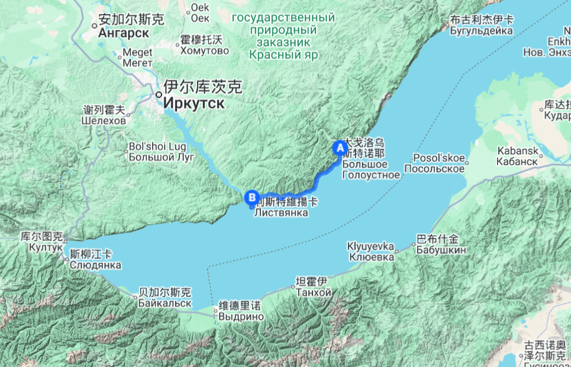

# 贝加尔50径｜西伯利亚徒步路线推介

---

## 路线总览

| 项目 | 内容 |
|------|------|
| **路线名称** | 贝加尔50径 |
| **起终点** | 利斯特维扬卡（Листвянка/利镇） → 大戈洛（Большое Голоустное） |
| **全程距离** | 约50公里 |
| **徒步天数** | 3天重装（全程6天） |
| **难度评级** | ★★★☆☆（中等，适合有重装经验者） |
| **出行时间** | 6月 — 9月，批次视报名情况确定 |
| **路线类型** | 贝加尔湖西岸沿湖徒步，单向穿越 |

*贝加尔湖西岸 · 利斯特维扬卡 → 大戈洛 路线轨迹*

---

## 这条路为谁准备

如果你符合下面几条，贝加尔50径就是你在找的路线：

- 有过重装徒步经验，不把户外当观光
- 厌倦了国内线路的拥挤和商业化，想走一条真正安静的路
- 不需要网红打卡点、不追求拍照出片，只想要一段完整的、属于自己的徒步经历
- 愿意为一次高质量的旅行体验付费，不纠结于性价比
- 想在几天里彻底离开手机信号和工作消息，只走路、扎营、看湖

---

## 行程安排

### Day 1 ｜北京 → 伊尔库茨克

**主题：抵达西伯利亚**

- CA869 北京首都机场 12:55 → 伊尔库茨克 16:00
- 入住伊尔库茨克中心酒店（四星）
- 傍晚安加拉河畔散步，感受这座城市的气息

沿途从北京到伊尔库茨克的飞行仅3小时，但脚下的土地已从东亚都市变成了西伯利亚。安加拉河穿城而过，河对岸就是无边的针叶林——从这里开始，节奏慢下来。

---

### Day 2 ｜伊尔库茨克 → 利斯特维扬卡

**主题：了解你将用脚丈量的这片湖**

- 乘车前往利斯特维扬卡（约1小时），入住利斯特维扬卡贝加尔酒店（四星）
- 参观贝加尔湖博物馆
  - 了解贝加尔湖的生态系统、地质演变以及丰富的动植物标本
  - 为什么它是世界上最深的湖、蓄水量占全球地表淡水20%以上
  - 徒步前先读懂这片水
- 装备最后检查、个人物资补充
- 早睡，明天开始徒步

---

### Day 3 ｜利斯特维扬卡 → 黑谷营地

**主题：第一脚踩进荒野**

- 里程：约16公里
- 路况：沿湖岸线，森林与湖畔交替
- 夜宿：黑谷营地（帐篷）

从镇子边缘出发，最初几公里还有零星的木屋和渔船。随着脚步深入，人类痕迹逐渐消失，左手是针叶林，右手是贝加尔湖无边的灰蓝色水面。16公里的距离对重装来说是很好的适应日，让肩膀和膝盖慢慢进入状态。

---

### Day 4 ｜黑谷营地 → 大卡季角2号营地

**主题：最丰富的一天**

- 里程：约18公里（全程最长的一段）
- 途经：大科特村（Большие Коты）、斯克佩瑞尔悬崖、鬼桥
- 夜宿：大卡季角2号营地
- 难度：★★★☆☆（本日爬升较大）

大科特村是一个只有几十人的老信徒村落，不通公路，夏季靠船、冬季靠冰面与外界联系。村子有几户人家养牛、捕鱼，你可以在这里补水和遇到徒步全程为数不多的"文明"。斯克佩瑞尔悬崖是整条路线上最壮观的观景点之一，也是贝加尔湖岸的最高点，站在岩石突出部俯瞰贝加尔湖，湖水的颜色会随着云影变化。鬼桥是开凿在巨大崖壁上的一条栈道，崖壁上布满了海鸥的巢穴，走在栈道上海鸥会在你周围飞翔。

这一天走完18公里、在营地篝火旁坐下时，你会发现自己已经进入了一种少有的平静——

> *不看手机、不想工作、不计划明天，只知道帐篷外面就是西伯利亚的风和贝加尔湖的浪声。*

---

### Day 5 ｜大卡季角2号营地 → 大戈洛

**主题：抵达终点，也是新的开始**

- 里程：约16公里
- 途经：科尔顿营地、大角湾、悬崖帐篷营地
- 终点：大戈洛（Большое Голоустное）
- 乘车返回伊尔库茨克（车程约2小时），入住伊尔库茨克中心酒店（四星）

最后一天的湖岸线并没有因为快到终点而变得平缓，一路的空中栈道能让你充分领略贝加尔湖的深邃和湛蓝。大戈洛的滩涂在远处出现的瞬间，也是这三天徒步接近终点的信号。当你在终点放下背包回望来路，除了身体的疲惫，更多的是这段路带给你的东西——三天几乎没有信号的荒野行走，让你的心和节奏回到了最原始的步调。

---

### Day 6 ｜伊尔库茨克

**主题：西伯利亚的文化注脚**

- 参观十二月党人纪念馆
  - 1825年十二月党人起义失败后，上百名贵族被流放至此
  - 他们的妻子放弃贵族身份跨越6000公里追随丈夫来到西伯利亚
  - 这些受过高等教育的流放者对西伯利亚的文化、教育、城市建设产生了深远影响
- 伊尔库茨克老城散步：木雕建筑、安加拉河畔、中央市场
- CA870 伊尔库茨克 18:00 → 北京 20:55

---

## 这条路线与游客路线的区别

| 对比项 | 常规贝加尔湖旅游 | 贝加尔50径 |
|--------|----------------|-----------|
| 行程方式 | 包车观光、环湖游 | 重装徒步、沿湖穿越 |
| 接触深度 | 景点打卡、拍照 | 身体力行、与湖共生 |
| 人流量 | 热门景点人满为患 | 全程几无他人 |
| 住宿 | 酒店/民宿 | 露营（自带帐篷） |
| 信号 | 全覆盖 | 绝大部分路段无信号，仅个别点位有信号 |
| 体验感 | 消费风景 | 感受荒野 |

---

## 基础信息

- **语言**：领队与协作均精通俄语，全程提供翻译服务
- **签证**：中俄互免签证，个人亦无需办理签证，持有效护照即可入境
- **交通**：北京直飞伊尔库茨克（约3小时航程），全程用车
- **出行时间**：6-9月（日间15-25℃，夜间5-10℃），批次视报名情况确定
- **难度**：中等，适合有重装徒步经验的爱好者
- **补给点**：沿途仅大科特村有有限补给，出发前需在利斯特维扬卡备齐个人物资
- **风险点**：天气突变，恐高者慎入（斯克佩瑞尔悬崖、鬼桥）

---

## 领队与协作

**领队 · 怪咖叔**

在俄罗斯工作生活多年，精通俄语，熟悉俄罗斯人文历史；长期坚持跑步、游泳、自行车等耐力运动。亲自穿越过贝加尔50径全程，对每一段路况、营地、风险点了然于心。

实地穿越视频：[b23.tv/TQ7VnFN](https://b23.tv/TQ7VnFN)

**协作 · 包刚**

精通俄语，全程负责翻译与沟通协调；马拉松、自行车爱好者，体力与耐力俱佳。

---

## 费用与接待

**价格：16,200 元 / 人**

> 对比参考：同级别国际徒步商业团（如尼泊尔 ABC、欧洲环勃朗峰）普遍 1.5-3 万元；贝加尔50径含往返机票、四星酒店与全程服务，1.62 万全包。

**价格包含：**

- 往返国航 CA869 / CA870 机票（托运行李 1×23kg，手提行李 1×7kg）
- 酒店住宿（共3晚，全部单人大床房：伊尔库茨克中心酒店 Day 1、Day 5；利斯特维扬卡贝加尔酒店 Day 2）
  - 伊尔库茨克中心酒店（四星） — [eastlandhotels.com](https://eastlandhotels.com)
  - 利斯特维扬卡贝加尔酒店（四星） — [eastland-baikal.ru](https://eastland-baikal.ru/ru/offers)
- 全程标准餐
- 进入国家公园手续及相关门票
- 接送机及全程用车
- 领队及协作服务费用
- 全程翻译服务
- 境外及户外意外伤害险（京东安联麦哲伦计划：医疗运送和送返 200 万、意外身故及伤残 100 万）

**价格不含：**

- 个人消费
- 徒步个人装备（帐篷、睡袋、防潮垫、登山杖等，需自备）

**成团说明：** 5—6 人成团，每团配备 1 名领队、1 名协作。出行时间 6-9 月，批次与出发日期视报名情况确定。

---

## 装备清单（需自备）

| 类别 | 装备 | 备注 |
|------|------|------|
| **背负** | 登山包（50—70L） | 重装背负，建议带防雨罩 |
| **露营** | 帐篷 | 三季帐即可 |
| | 睡袋 | 舒适温标 ≤5℃ |
| | 防潮垫 | / |
| **衣物** | 冲锋衣裤 | 防风防水 |
| | 保暖层（抓绒/羽绒） | 夜间温度可降至5℃以下 |
| | 速干内衣（2套） | 羊毛或合成面料 |
| | 徒步裤（1条） | / |
| | 防水登山鞋 | 建议已磨合的旧鞋 |
| | 备用厚袜（羊毛袜，2双以上） | / |
| | 遮阳帽 + 保暖帽 | / |
| | 手套 | / |
| **配件** | 登山杖（1对） | / |
| | 头灯 + 备用电池 | / |
| | 水具（2—3L） | 水袋或水壶 |
| | 炉头 + 套锅 + 餐具 | / |
| | 气罐 | 无需自备，由领队统一购买分发 |
| **其他** | 防晒霜、墨镜 | / |
| | 个人急救包 | 常用药品、创可贴、消毒用品 |
| | 垃圾袋 | 全程无垃圾桶，所有垃圾自行带出 |
| | 充电宝 | 绝大部分路段无信号，但电子设备仍需充电 |

> *如果没有帐篷/睡袋等大件装备，可提前告知代为协调租赁，费用个人承担。*

---

## 说明事项

### 活动性质

本活动为**自助式户外徒步约伴活动，非旅行社旅游产品**。参与者需知悉并接受户外活动固有风险（天气变化、地形险峻、失温、野生动物等），自愿参加，风险自担。出发前签署《风险告知与知情同意书》，费用已含足额户外意外伤害险。

### 风险与安全

- **路线**：为国家公园内成熟徒步路线，有清晰的路标指示，路线周围不会出现大型野生动物
- **信号**：绝大部分路段无信号，仅个别点位有信号（通讯良好）
- **保险**：境外及户外意外伤害险（京东安联麦哲伦计划：医疗运送和送返 200 万、意外身故及伤残 100 万）；领队全程携带卫星电话/应急通讯设备
- **中途自愿退出**：可联系国家公园管理机构安排交通接出，相关费用由个人承担
- **危险路段**：斯克佩瑞尔悬崖横切段、鬼桥栈道，恐高者慎入
- **天气**：西伯利亚天气多变，夜间温度可降至 5℃ 以下，五月底仍可能出现雨夹雪（雨夹雪天气不影响徒步）

### 徒步生活

- **餐食**：徒步以外为标准俄餐；徒步餐由领队提前采购出发前分发——肉肠、果酱或蜂蜜、面包、黄油、水果等
- **路况**：第一天初始段有较大爬升和下降，其余路段落差不大；第二天仅斯克佩瑞尔悬崖段有爬升；第三天全程落差较为平均
- **营地**：营地位置地势平坦，一般有简易搭建的木质条桌和长凳，配有火膛
- **用水**：徒步期间生活用水取用贝加尔湖水

### 付款与退改

**流程**：咨询 → 凑够 5-6 人 → 确定出发日期 → 交首付款 → 出发前 15 日交尾款

**付款**：
- 确定出发日期后支付首付款 10,000 元，购机票、订酒店和车辆等
- 出发前 15 日支付尾款 6,200 元
- 付款方式：微信/银行转账（付款前请先与领队确认）

**退改**：
- 因不成团导致行程取消，首付款全额退还
- 因不可抗力（天气、航班、政策等）导致行程取消，全额退款或顺延至下一批次
- 因个人原因取消：出发前 15 日以上，可退还尾款 6,200 元，首付款不予退还；出发前 15 日内（含），尾款不予退还

### 装备与出行

- **气罐**：由领队在伊尔库茨克统一购买，徒步前分发到每名队员
- **登机注意**：带有电子打火的炉头不能上飞机；登山杖需托运
- **装备租赁**：大件装备（帐篷/睡袋等）可提前告知，代为协调租赁，费用个人承担

### 其他

- **翻译**：领队与协作均精通俄语，全程提供翻译服务，沟通无障碍
- **房型**：全程酒店均为单人大床房
- **集合**：首都机场统一集合出发
- **签证**：中俄互免签证，个人无需办理签证，持有效护照（有效期半年以上）即可入境

---

## 联系方式

- **电话 / 短信：** 18618375879
- **微信：** youla7982
- **邮箱：** chq324@126.com
- **小红书：** [贝加尔50径](https://xhslink.cn/m/1q8Sq05uGYg)

> *西伯利亚荒野不跟你商量。但敢走进它的人，走出去后跟走进去的不会是同一个人。*
